<div align="center">

# 🎙️ MinutesAI

### AI-Powered Meeting Minutes Generator

*Transform meeting transcripts into structured, actionable minutes with the power of AI*

[](https://www.python.org/downloads/)
[](https://opensource.org/licenses/MIT)
[](https://github.com/psf/black)
[](CONTRIBUTING.md)
[](#)
[](docs/)

[Features](#-features) • [Quick Start](#-quick-start) • [Documentation](#-documentation) • [Contributing](#-contributing) • [License](#-license)

</div>

---

## 🌟 Overview

**MinutesAI** is an intelligent meeting minutes generator that automatically transforms raw meeting transcripts into structured, professional documentation. Built with modern AI frameworks ([LangChain](https://python.langchain.com/docs/) and [Ollama](https://ollama.com/)), MinutesAI eliminates the tedious task of manual note-taking and ensures consistent, comprehensive meeting records.

Designed with **Object-Oriented Programming** principles, MinutesAI offers maintainability, scalability, and ease of collaboration—perfect for teams of all sizes.

### 💡 Why MinutesAI?

- ⏱️ **Save Hours**: Automate what used to take 30+ minutes per meeting
- 📊 **Consistent Quality**: Standardized output format every time
- 🎯 **Action-Oriented**: Automatically extract action items and decisions
- 🔧 **Developer-Friendly**: Clean OOP design with comprehensive testing
- 🚀 **Production-Ready**: CLI and Streamlit interfaces included

---

## ✨ Features

### Core Capabilities

- 🤖 **AI-Powered Extraction**: Leverages LangChain and Ollama for intelligent content analysis
- 📝 **Structured Output**: Generates standardized sections including:
  - Meeting Title & Metadata
  - Date, Time & Attendees
  - Agenda Items
  - Key Discussion Points
  - Action Items with Assignees
  - Decisions Made
  - Next Steps
- 📁 **Multi-Format Support**:
  - **Input**: `.txt`, `.doc`, `.mp3` (audio transcription)
  - **Output**: `.pdf`, `.json`, `.html`
- 🎨 **Flexible Interfaces**:
  - Command-line interface (CLI)
  - Web interface (Streamlit)
- 🧩 **Extensible Architecture**: Modular OOP design for easy customization
- ✅ **Comprehensive Testing**: Full test suite with pre-commit hooks

---

## 🏗️ Architecture

```mermaid
graph LR
    A[📄 Transcript Input] --> B[TranscriptLoader]
    B --> C[MinutesAIExtractor]
    C --> D[MinutesAIFormatter]
    D --> E[📋 Structured Output]
    
    B -.-> F[(Preprocessing)]
    C -.-> G[(LangChain + Ollama)]
    D -.-> H[(Format Conversion)]
```



### 🔧 Core Components

| Component | Responsibility |
|-----------|----------------|
| **TranscriptLoader** | Loads and preprocesses meeting transcripts from various formats |
| **MinutesAIExtractor** | Uses LangChain and Ollama to extract structured meeting data via intelligent prompting |
| **MinutesAIFormatter** | Formats extracted data into multiple output formats (text, JSON, HTML, PDF) |
| **MinutesAIApp** | Orchestrates the end-to-end workflow and provides user interfaces |

---

## 🚀 Quick Start

### Prerequisites

- Python 3.8 or higher
- [Ollama](https://ollama.com/) installed and running
- Git

### Installation

```bash
# Clone the repository
git clone https://github.com/dhanvina/mom.git
cd mom

# Create virtual environment
python -m venv venv
source venv/bin/activate  # On Windows: venv\Scripts\activate

# Install dependencies
pip install -r requirements.txt

# Install Ollama model (if not already installed)
ollama pull llama2
```

### Basic Usage

#### CLI Interface

```bash
# Generate minutes from a transcript file
python main.py --input meeting_transcript.txt --output minutes.pdf

# Specify custom model
python main.py --input transcript.txt --model llama2 --output minutes.json
```

#### Python API

```python
from minutesai import MinutesAIApp, TranscriptLoader, MinutesAIExtractor

# Initialize the application
app = MinutesAIApp()

# Load transcript
transcript = app.load_transcript("meeting_transcript.txt")

# Extract and format minutes
minutes = app.generate_minutes(transcript, output_format="pdf")

# Save output
app.save_minutes(minutes, "meeting_minutes.pdf")
```

#### Streamlit Web Interface

```bash
# Launch the web interface
streamlit run app.py
```

Then open your browser to `http://localhost:8501` and upload your transcript!

---

## 📖 Documentation

- 📘 [**Quickstart Guide**](docs/quickstart_guide.md) - Get up and running in 5 minutes
- 🏗️ [**Architecture Overview**](docs/architecture.md) - Deep dive into system design
- 🔌 [**API Reference**](docs/api_reference.md) - Complete API documentation
- 🎨 [**Customization Guide**](docs/customization.md) - Extend and customize MinutesAI
- 🧪 [**Testing Guide**](docs/testing.md) - Running and writing tests
- 🐛 [**Troubleshooting**](docs/troubleshooting.md) - Common issues and solutions

---

## 🔍 Example Output

### Input Transcript
```
John: Hey everyone, thanks for joining. Today we need to discuss the Q4 roadmap.
Sarah: I think we should prioritize the mobile app redesign.
John: Agreed. Mike, can you lead that initiative?
Mike: Sure, I'll draft the requirements by Friday.
```

### Generated Minutes

```markdown
# Q4 Planning Meeting

**Date:** October 28, 2025, 3:00 PM  
**Attendees:** John, Sarah, Mike

## Agenda
- Q4 Roadmap Discussion

## Key Discussion Points
- Mobile app redesign identified as top priority for Q4
- Team consensus on moving forward with the redesign

## Decisions Made
- ✅ Prioritize mobile app redesign in Q4 roadmap

## Action Items
- [ ] Mike: Draft requirements for mobile app redesign (Due: Friday)

## Next Steps
- Review requirements document in next meeting
```

---

## 🤝 Contributing

We welcome contributions from the community! Whether it's bug fixes, new features, or documentation improvements, your help is appreciated.

### How to Contribute

1. **Fork the repository**
2. **Create a feature branch**: `git checkout -b feature/amazing-feature`
3. **Make your changes** and commit: `git commit -m 'Add amazing feature'`
4. **Push to your branch**: `git push origin feature/amazing-feature`
5. **Open a Pull Request**

### Development Setup

```bash
# Install development dependencies
pip install -r requirements-dev.txt

# Install pre-commit hooks
pre-commit install

# Run tests
pytest

# Run linters
black .
flake8 .
mypy .
```

### Guidelines

- Follow [PEP 8](https://pep8.org/) style guide
- Write tests for new features
- Update documentation as needed
- Keep commits atomic and well-described

See [CONTRIBUTING.md](CONTRIBUTING.md) for detailed guidelines and our [Code of Conduct](CODE_OF_CONDUCT.md).

---

## 🧪 Testing

```bash
# Run all tests
pytest

# Run with coverage
pytest --cov=minutesai --cov-report=html

# Run specific test file
pytest tests/test_extractor.py
```

---

## 🗺️ Roadmap

- [x] Core transcript processing engine
- [x] CLI interface
- [x] Streamlit web interface
- [x] PDF output support
- [ ] Real-time audio transcription integration
- [ ] Multi-language support
- [ ] Calendar integration (Google Calendar, Outlook)
- [ ] Slack/Teams bot integration
- [ ] Template customization UI
- [ ] Cloud deployment options

---

## 📊 Tech Stack

- **Language**: Python 3.8+
- **AI Framework**: [LangChain](https://python.langchain.com/)
- **LLM Engine**: [Ollama](https://ollama.com/)
- **Web Framework**: [Streamlit](https://streamlit.io/)
- **Testing**: pytest, pytest-cov
- **Code Quality**: black, flake8, mypy, pre-commit

---

## 📄 License

This project is licensed under the MIT License - see the [LICENSE](LICENSE) file for details.

```
MIT License - Copyright (c) 2025 MinutesAI Contributors
```

---

## 🙏 Acknowledgments

- Built with [LangChain](https://python.langchain.com/) - The AI framework for building LLM applications
- Powered by [Ollama](https://ollama.com/) - Run large language models locally
- Inspired by the need for efficient meeting documentation

---

## 📬 Contact & Support

- **Issues**: [GitHub Issues](https://github.com/dhanvina/mom/issues)
- **Discussions**: [GitHub Discussions](https://github.com/dhanvina/mom/discussions)
- **Pull Requests**: [GitHub PRs](https://github.com/dhanvina/mom/pulls)

---

<div align="center">

### ⭐ Star us on GitHub — it motivates us a lot!

[](https://github.com/dhanvina/mom)
[](https://github.com/dhanvina/mom/fork)
[](https://github.com/dhanvina/mom)

**Made with ❤️ by the MinutesAI Team**

[⬆ back to top](#-minutesai)

</div>
